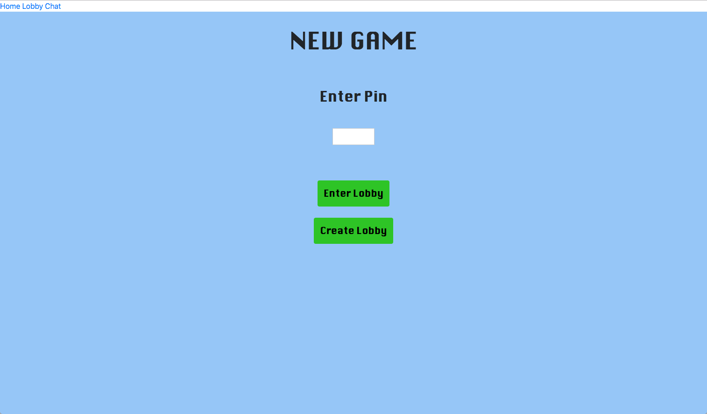
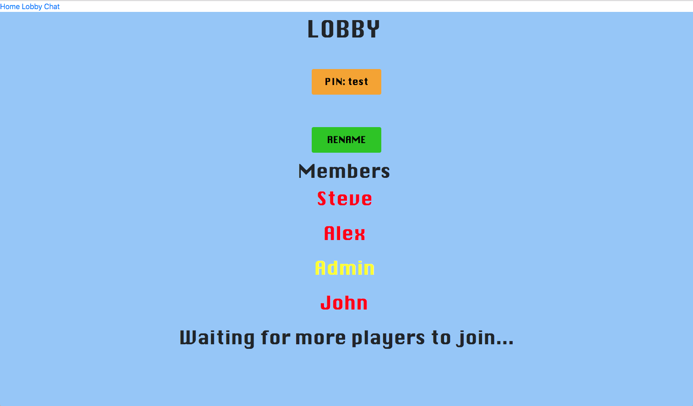
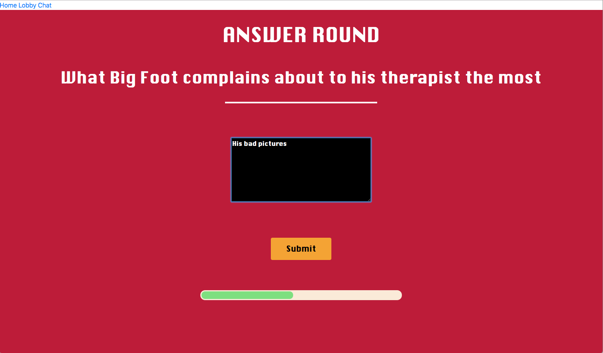
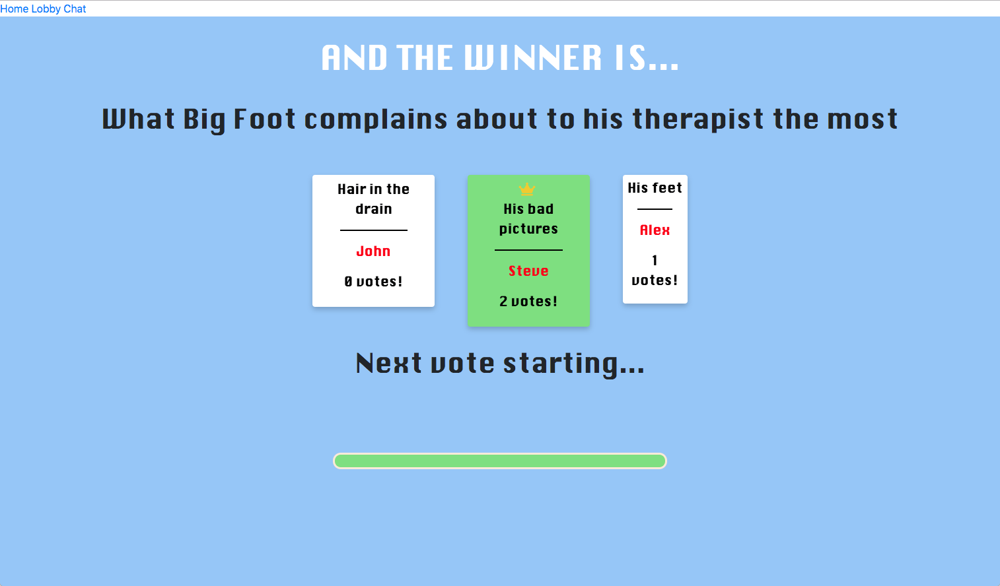

## Screenshots
#### Homepage

#### Lobby

#### Answer Round

#### Voting Round

#### Winner Results



## Build Setup

``` bash
# install dependencies
npm install

# serve with hot reload at localhost:8080
npm run dev

# run redis at localhost:6379
redis-server

# run express server
cd server
node app.js

```
